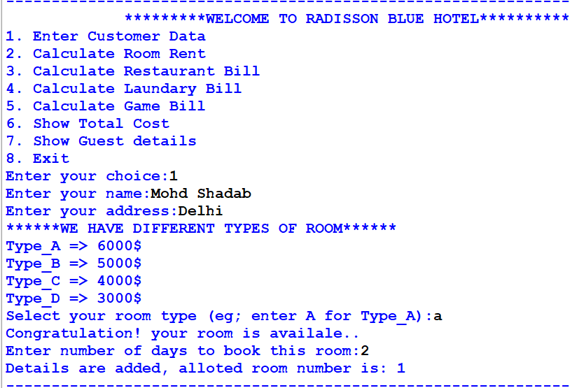
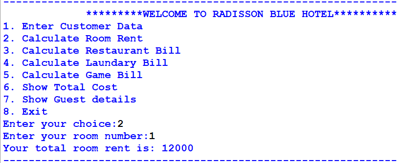
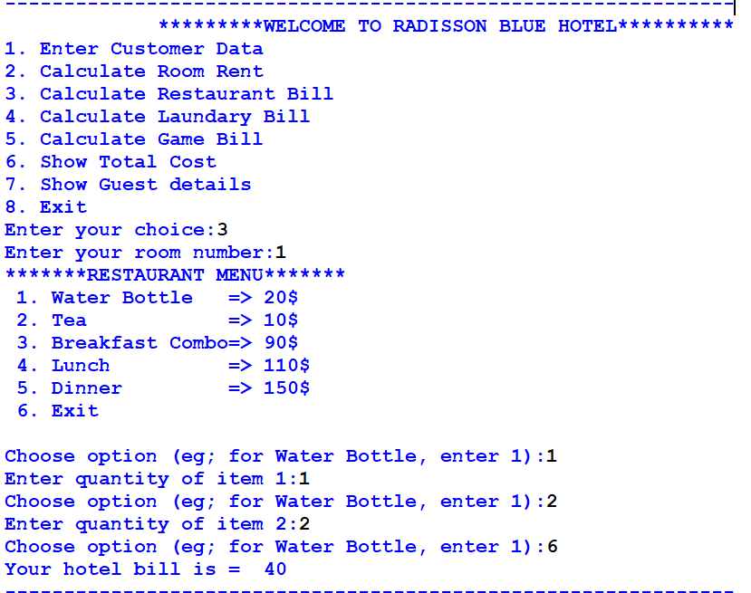
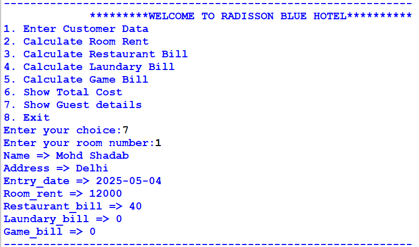

# Hotel_Management_System

## 🏨 Hotel Management System – Radisson Blue (Console-based)
This is a simple Hotel Management System developed in Python that simulates basic hotel operations like booking rooms, calculating various bills, and maintaining guest records. It is designed for console use and mimics the working of a hotel front-desk system.

### ✨ Features
1. 📋 Customer data entry (name, address, check-in date, alloted room number)

2. 🏨 Room booking with limited availability:

 1. Type A: 6000$ per day (2 rooms)

 2. Type B: 5000$ per day (2 rooms)

 3. Type C: 3000$ per day (2 rooms)

 4. Type D: 3000$ per day (2 rooms)

3. 📦 Inventory management – room availability decreases after booking.

4. 🚫 If all rooms of a type are booked, system will notify no availability.

5. 🍽️ Restaurant bill calculation from a fixed menu

6. 🧺 Laundry and Game bill calculation

7. 💵 Total cost display with breakdown

8. 📃 Guest details display

### 🖥️ Program Interface
Here are some screenshots of how the system works:

##### Customer Check-in and Room Booking

👆Enter guest name, address, choose room type. (Room availability is checked before finalizing.)

##### Option to check your room rent

##### Option to calculate restaurant, laundry, and game bills.

##### Total Bill and Guest Summary

👆Shows breakdown of guest info, address, room number and bill of each expenses.

### 🚀 How to Run
1. Run the Python script 'Hotel_Management_System.py' in a terminal.

2. Follow the interactive menu to perform operations.

### ✅ Future Improvements
1. Add data persistence (saving to a file or database)

2. Implement GUI using Tkinter or PyQt

3. Add checkout functionality and date-based billing

